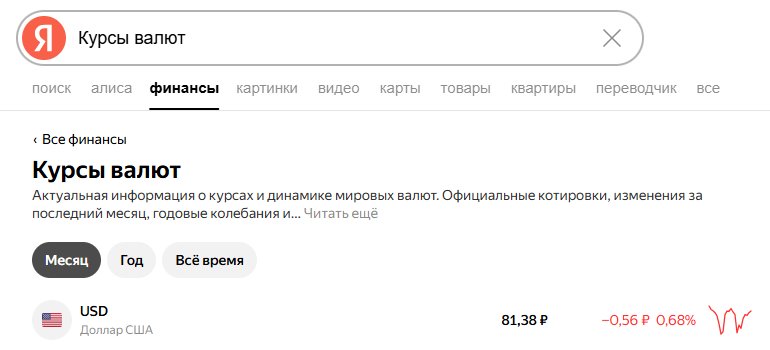
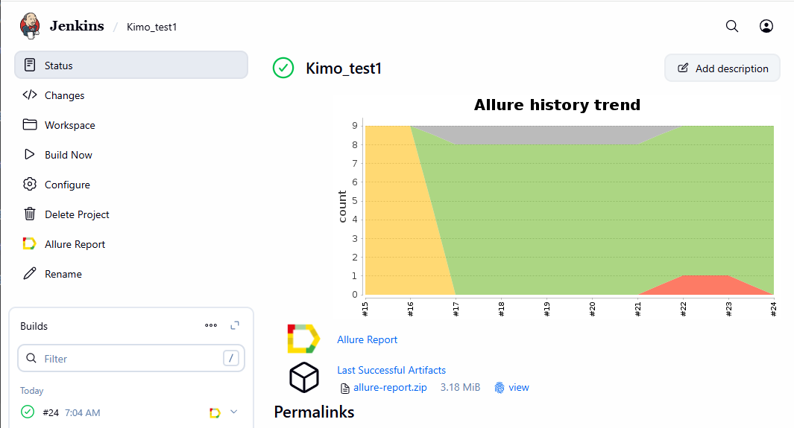
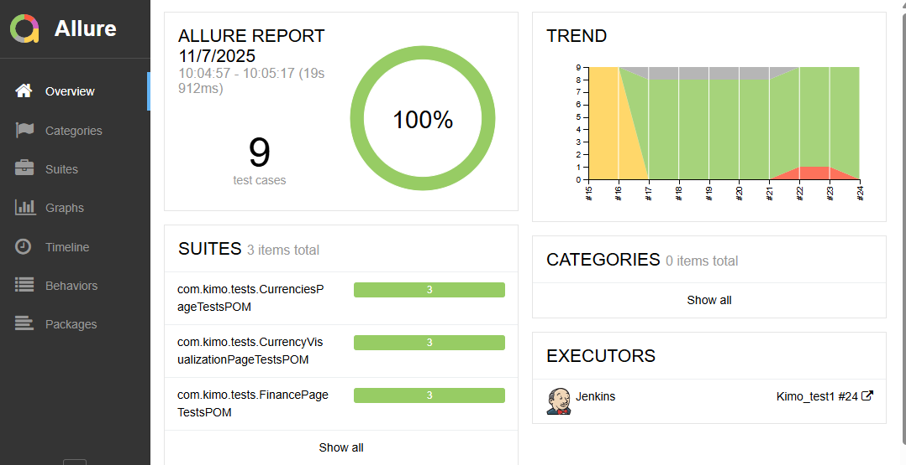
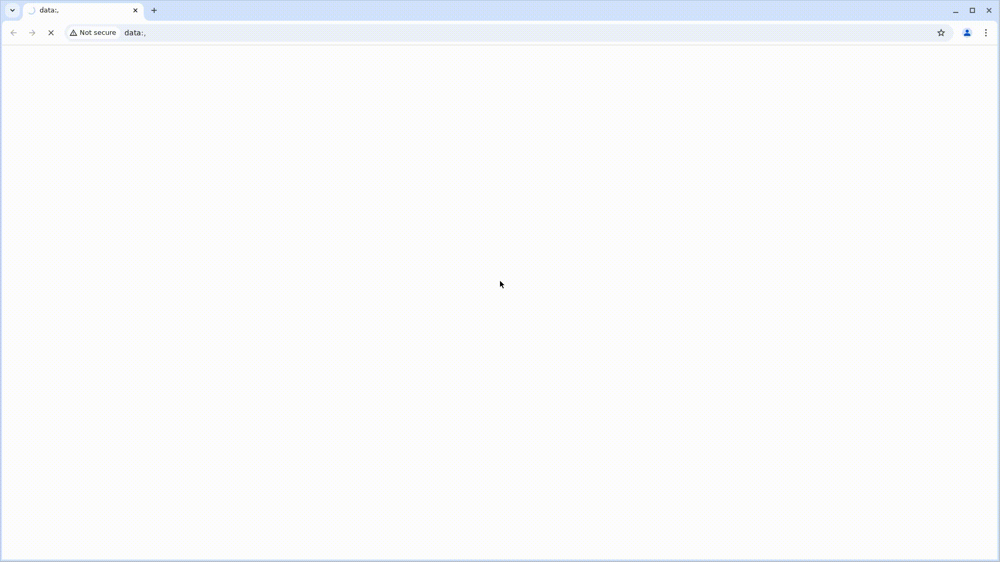

# Проект по автоматизации тестирования приложения Яндекс.Финансы


## :pushpin: Содержание:

- [Описание](#open_book-описание)
- [Чек-лист проверок](#open_book-описание)
- [Использованный стек технологий](#computer-использованный-стек-технологий)
- [Запуск тестов](#running_woman-запуск-тестов)
- [Сборка в Jenkins](#-сборка-в-jenkins)
- [Пример Allure-отчета](#-пример-allure-отчета)

## :open_book: Описание
В проекте реализованы UI тесты для веб приложения yandex_finance.


## 📋 Чек-лист проверок

### Главная страница (https://yandex.ru/finance)
- [ ] **TC-001**: Проверка поиска Курсов валют через строку Поиска
- [ ] **TC-002**: Проверка перехода в окно Курсы валют по кнопке Валюты > Показать все
- [ ] **TC-003**: Проверка открытия окна Курсы валют по ссылке Курсы валют в Популярных запросах
### Страница Курсы валют (https://yandex.ru/finance/currencies)
- [ ] **TC-004**: Проверка отображения/скрытия полного текста по нажатию Читать еще/Скрыть
- [ ] **TC-005**: Проверка открытия детальной информации о валюте по нажатию на ее название
- [ ] **TC-006**: Проверка увеличения количества отображаемых валют по нажатию Показать еще
### Страница Конвертер валют (https://yandex.ru/finance/currencies/USD_RUB)
- [ ] **TC-007**: Проверка отображения конвертируемой валюты после ее смены
- [ ] **TC-008**: Проверка актуальности даты текущего курса
- [ ] **TC-009**: Проверка отображения валют после нажатия кнопки Поменять местами значения


## :computer: Использованный стек технологий

<p align="center">
<code></code>
<code></code>
<code></code>
<code></code>
<code></code>
<code></code>
<code></code>
<code></code>
<code></code>
</p>

Автотесты написаны на <code>Java</code> с использованием <code>JUnit 5</code> и <code>Gradle</code>.
Для UI-тестов использован фреймворк [Selenide](https://selenide.org/).
Запуск тестов можно осуществлять локально или в [Selenoid](https://aerokube.com/selenoid/)

Allure-отчет включает в себя:
* шаги выполнения тестов;
* логирование отправленных API запросов
* скриншот страницы в браузере в момент окончания автотеста;
* Page Source;
* логи браузерной консоли;
* видео выполнения автотеста.

## :running_woman: Запуск тестов

### Локальный запуск тестов
Запуск web-тестов
```
./gradlew finance_test
```


### Запуск тестов на удаленном браузере
Для запуска web-тестов в selenoid
```
./gradlew finance_test
```


##  Сборка в Jenkins

**Configure:**
- **Repository:** `https://github.com/EkaterinaMelnikova/ya_finance_tests.git` *(SCM > Git)*
- **Branch:** `*/remote` *(SCM > Branches to build)*
- **Gradle Version:** `Gradle 8.12` *(Build Steps > Invoke Gradle)*
- **Command:** `clean finance_test` *(Build Steps > Tasks)*
- **Allure Path:** `build/allure-results/` *(Allure Report)*


<p align="center">

</p>

##  Пример Allure-отчета
### Overview

<p align="center">

</p>

### Результат выполнения теста

<p align="center">

</p>

При запуске тестов в remote-окружении к каждому тесту в отчете прилагается видео.
<p>Пример видео из Selenoid</p>
<p align="center">
  
</p>

